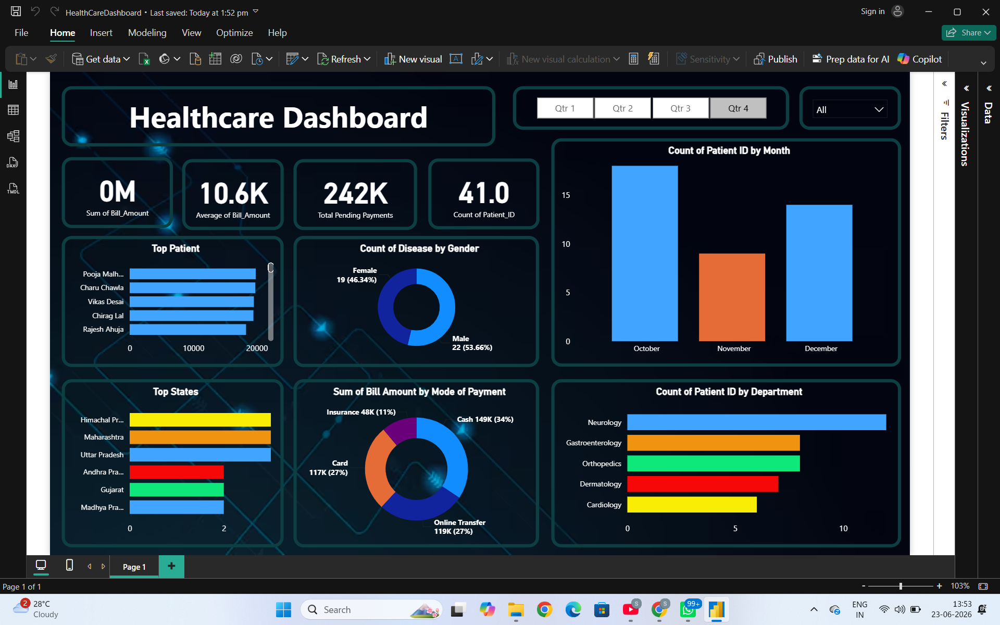

# Healthcare Dashboard Using Power BI

## Overview
An interactive Healthcare Analytics Dashboard developed using Power BI to analyze patient records, billing information, payment methods, disease distribution, and department-wise performance.

## Dashboard Preview

## Features
- KPI Cards for Total Billing, Average Billing, Pending Payments, and Patient Count
- Disease Distribution by Gender
- Department-wise Patient Analysis
- State-wise Patient Distribution
- Payment Method Analysis
- Monthly Patient Trends
- Quarterly Filtering using Slicers

## Tools & Technologies
- Power BI
- Power Query
- DAX
- Data Visualization
- Excel/CSV

## Key Insights
- Neurology department recorded the highest patient count.
- Online Transfer was the most preferred payment method.
- October had the highest patient registrations.
- Multiple interactive filters enable detailed healthcare analysis.

## Skills Demonstrated
- Data Cleaning
- Data Modeling
- DAX Calculations
- Dashboard Design
- Business Intelligence Reporting

## Repository Contents
- HealthcareDashboard.pbix
- Dashboard Screenshots
- README Documentation
